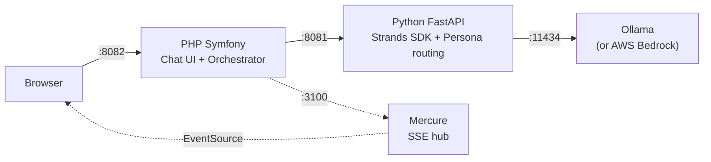

# The Summit

Multi-agent group chat where AI characters debate your questions. Three characters are randomly selected per session from a roster of 10 distinct personalities. Built with [strands-php-client](https://github.com/blundergoat/strands-client) + [strands-symfony-bundle](https://github.com/blundergoat/strands-bundle).

*"Your question, cross-examined by three characters who disagree on purpose."*

## How It Works

You ask a question. Three characters are randomly drawn from a roster of 10 and respond in sequence, each seeing what the others said:

| Character | Personality |
|-----------|-------------|
| Angry Chef | Gordon Ramsay on a bad day. Everything is raw, overcooked, or a bloody disgrace. |
| Medieval Knight | Old English flair. Honour, quests, and chivalry. |
| Gandalf | Cryptic wisdom and ominous warnings. A wizard arrives precisely when he means to. |
| Your Nan | Worries you're not eating. Everything relates to 1974. |
| Terminator | Cold, logical, robotic. Assesses threats and calculates probabilities. |
| Film Noir Detective | Hardboiled 1940s cynicism. The city is always dark, dames are trouble. |
| Kindergarten Teacher | Explains everything to five-year-olds. Gold stars for good ideas. |
| Roman Emperor | Imperial authority. Everything is for the glory of Rome. |
| Infomercial Host | Everything is the GREATEST thing ever. BUT WAIT, THERE'S MORE. |
| Ship's Cat | Judges humans from a cat's perspective. Would rather be sleeping. |

Sometimes one character gets a secret objective — a hidden side mission injected into their prompt that amplifies their personality. The other two play it straight, creating comedic contrast.

## Quick Start

### Docker Compose (recommended)

```bash
git clone https://github.com/blundergoat/the-summit-chatroom.git
cd the-summit-chatroom
cp .env.example .env
docker compose up --build
```

Open http://localhost:8082 and ask a question.

First run downloads the LLM model (~9GB for `qwen2.5:14b`). Subsequent starts are fast.

### Bare-metal (for development)

```bash
./scripts/setup-initial.sh
./scripts/start-dev.sh
```

Open http://localhost:8082. See [docs/local-development.md](docs/local-development.md) for details.

## Requirements

- Docker and Docker Compose
- ~12GB free disk space (model + containers)
- GPU with 16GB+ VRAM recommended (runs on CPU too, just slower)

No cloud accounts or API keys needed for local development.

## Architecture



The PHP app orchestrates the summit: it calls the Python agent three times in sequence (once per character), passing the persona name as metadata. The agent selects the matching system prompt and calls the LLM. Mercure enables real-time token streaming to the browser.

### Docker Compose Services

| Service | Port | Purpose |
|---------|------|---------|
| **app** | 8082 | PHP Symfony chat UI and orchestration |
| **agent** | 8081 | Python FastAPI agent with Strands SDK |
| **ollama** | 11434 | Local LLM server |
| **mercure** | 3100 | Real-time SSE hub for streaming mode |

## Model Provider

Defaults to **Ollama** (local, free). Switch to **AWS Bedrock** by editing `.env`:

```env
# Local (default)
MODEL_PROVIDER=ollama
OLLAMA_MODEL=qwen2.5:14b

# AWS Bedrock
MODEL_PROVIDER=bedrock
AWS_ACCESS_KEY_ID=...
AWS_SECRET_ACCESS_KEY=...
MODEL_ID=us.anthropic.claude-sonnet-4-20250514-v1:0
```

## Modes

**Sync mode** — User sends message, waits for all three characters to respond sequentially. Works with both Docker and bare-metal.

**Streaming mode** — Characters stream token-by-token via Mercure. Text appears in real-time like a group chat. Requires the Mercure container (Docker Compose has it by default).

## Project Structure

```
the-summit-chatroom/
├── src/                    # PHP Symfony app
│   ├── Controller/         # ChatController (routes requests)
│   └── Service/            # SummitOrchestrator + SummitStreamOrchestrator
├── templates/              # Twig chat UI (chatroom.html.twig)
├── strands_agents/         # Python agent
│   ├── api/server.py       # FastAPI HTTP layer
│   ├── agents/             # Persona system prompts + agent creation
│   ├── session.py          # In-memory conversation history
│   └── persona_objectives.py # Secret objectives system
├── config/                 # Symfony + Strands service wiring
├── tests/                  # PHPUnit tests
├── scripts/                # Dev scripts (start, deploy, terraform, preflight)
├── infra/terraform/        # AWS infrastructure (ECS Fargate, ALB, WAF)
├── docker-compose.yml      # Local dev stack
└── docs/                   # Detailed documentation
```

## Documentation

| Doc | Contents |
|-----|----------|
| [Local Development](docs/local-development.md) | Docker Compose and bare-metal setup, environment config, troubleshooting |
| [Deployment](docs/deployment.md) | deploy.sh and terraform.sh usage, deployment flow |
| [Infrastructure](docs/infrastructure.md) | AWS architecture, Terraform modules, CI/CD, cost estimate |
| [Terraform](docs/terraform.md) | Terraform backend setup, first-time bootstrap, quick reference |
| [Workflow](docs/workflow.md) | Claude Code hooks, skills, and workflow rules |

## License

Apache 2.0
