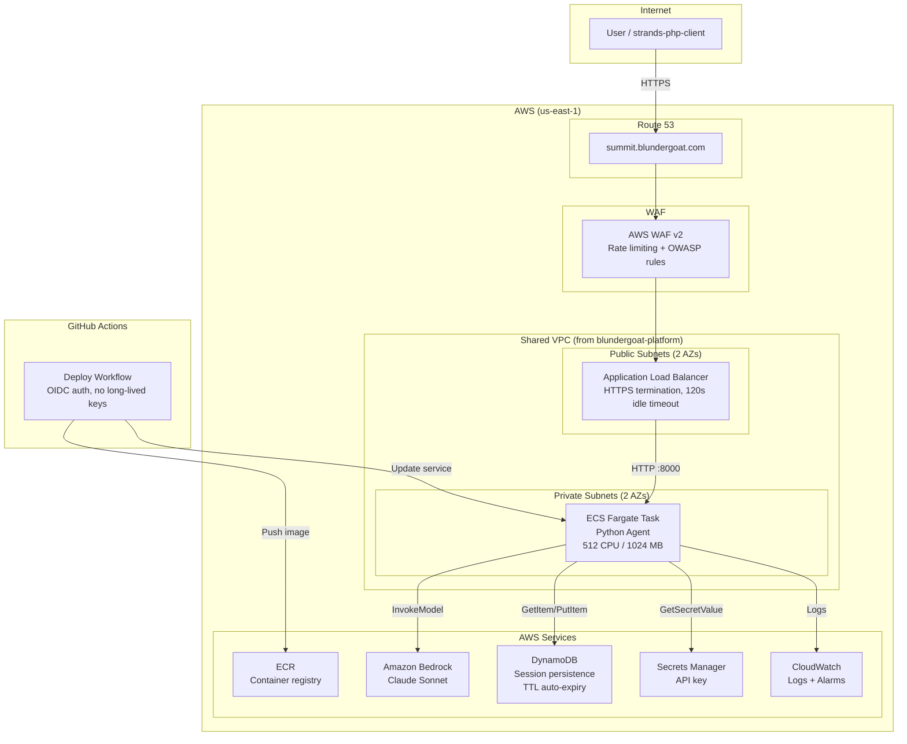
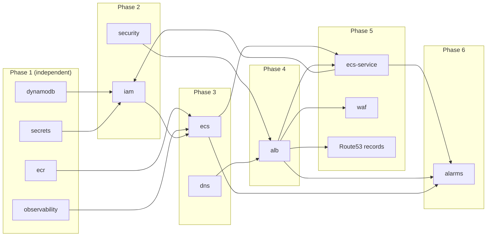

# AWS Infrastructure for the-summit-chatroom

Terraform infrastructure that deploys the Python agent to AWS Fargate behind an ALB, serving `summit.blundergoat.com`.

## Architecture



## Key Differences from blundergoat-platform

| Setting | blundergoat | the-summit |
|---------|------------|--------------|
| Container port | 8080 | 8000 |
| Health check | `/healthz` | `/health` |
| CPU / Memory | 256 / 512 | 512 / 1024 |
| ALB idle timeout | 60s | 120s (streaming) |
| Domain | blundergoat.com | summit.blundergoat.com |
| Database | RDS PostgreSQL | DynamoDB (sessions) |
| IAM task perms | RDS backups | Bedrock + DynamoDB |
| VPC | Owns VPC | Shares blundergoat's VPC |
| Migration task | Yes | No |

## File Structure

```
the-summit-chatroom/
├── infra/terraform/
│   ├── bootstrap/                    # Run once: S3 state bucket + DynamoDB lock
│   │   ├── main.tf
│   │   ├── variables.tf
│   │   ├── outputs.tf
│   │   └── versions.tf
│   ├── environments/prod/            # Root module orchestrating everything
│   │   ├── main.tf                   # Module wiring and agent env vars
│   │   ├── variables.tf              # All configurable settings
│   │   ├── outputs.tf                # ALB DNS, ECR URL, cluster name, etc.
│   │   ├── versions.tf               # Terraform >= 1.5.0, AWS >= 5.0.0
│   │   ├── backend.tf                # S3 backend (partial config)
│   │   ├── backend.hcl.example       # Backend config template
│   │   └── terraform.tfvars.example  # Variable values template
│   └── modules/
│       ├── dynamodb/                 # Session persistence table (NEW)
│       ├── ecr/                      # Container image registry
│       ├── secrets/                  # API key in Secrets Manager
│       ├── observability/            # CloudWatch log group
│       ├── security/                 # ALB + ECS security groups
│       ├── iam/                      # Execution role, task role (Bedrock + DynamoDB), GitHub OIDC
│       ├── ecs/                      # Cluster + agent task definition
│       ├── dns/                      # Route 53 hosted zone + ACM certificate
│       ├── alb/                      # Load balancer, target group, listeners
│       ├── ecs-service/              # Fargate service with circuit breaker
│       ├── waf/                      # AWS managed rules + rate limiting
│       └── alarms/                   # ALB 5xx, response time, ECS task count
├── scripts/
│   └── terraform.sh                  # Helper script for all terraform commands
└── .github/workflows/
    └── deploy-prod.yml               # CI/CD: build, push, deploy (no migrations)
```

## Prerequisites

1. **blundergoat-platform deployed** — this infrastructure shares its VPC and subnets
2. **Terraform >= 1.5.0** and **AWS CLI** installed
3. **AWS profile** `aws_devgoat` configured (`aws sso login --profile aws_devgoat`)
4. **Domain** `blundergoat.com` Route 53 hosted zone (from blundergoat-platform)

### Required outputs from blundergoat-platform

Run these in the blundergoat-platform terraform directory:

```bash
terraform output vpc_id
terraform output -json public_subnet_ids
terraform output -json private_subnet_ids
```

## Setup

### 1. Bootstrap (one-time)

Creates the S3 bucket and DynamoDB table for Terraform remote state.

```bash
./scripts/terraform.sh --bootstrap init
./scripts/terraform.sh --bootstrap apply
```

### 2. Configure

```bash
cd infra/terraform/environments/prod

# Backend config (S3 state)
cp backend.hcl.example backend.hcl
# Edit backend.hcl if you changed bootstrap defaults

# Variable values
cp terraform.tfvars.example terraform.tfvars
# Fill in: vpc_id, public_subnet_ids, private_subnet_ids, hosted_zone_id
```

### 3. Deploy

```bash
./scripts/terraform.sh init
./scripts/terraform.sh plan    # Review changes
./scripts/terraform.sh apply   # Create infrastructure
```

### 4. Push the agent image

```bash
# Get ECR URL
ECR_URL=$(./scripts/terraform.sh output -raw ecr_repository_url)

# Authenticate with ECR
aws ecr get-login-password --region us-east-1 | docker login --username AWS --password-stdin "$ECR_URL"

# Build and push
docker build -f strands_agents/Dockerfile \
  -t "$ECR_URL:v1.0.0" \
  strands_agents/
docker push "$ECR_URL:v1.0.0"

# Update the image tag and redeploy
# Edit terraform.tfvars: agent_image_tag = "v1.0.0"
./scripts/terraform.sh apply
```

### 5. Verify

```bash
# Health check
curl https://summit.blundergoat.com/health

# Invoke test
curl -X POST https://summit.blundergoat.com/invoke \
  -H 'Content-Type: application/json' \
  -d '{"message": "hello", "context": {"metadata": {"persona": "analyst"}}}'
```

## CI/CD

The GitHub Actions workflow (`.github/workflows/deploy-prod.yml`) runs on every push to `main`:

1. Authenticates to AWS via OIDC (no long-lived credentials)
2. Builds the Docker image from `strands_agents/`
3. Pushes to ECR with a `{sha}-{run}` tag
4. Registers a new ECS task definition
5. Updates the ECS service (rolling deployment with circuit breaker)
6. Verifies the correct image is running
7. Health checks `https://summit.blundergoat.com/health`

### Setup CI/CD

After `terraform apply`, set these in your GitHub repo settings (Settings > Secrets and variables > Actions > Variables):

| Variable | Value | Source |
|----------|-------|--------|
| `AWS_REGION` | `us-east-1` | — |
| `AWS_ROLE_ARN` | `arn:aws:iam::...` | `./scripts/terraform.sh output github_actions_role_arn` |

## Module Dependency Order



## Agent Environment Variables

These are injected into the ECS task at runtime:

| Variable | Value | Source |
|----------|-------|--------|
| `PORT` | `8000` | Hardcoded |
| `MODEL_ID` | `us.anthropic.claude-sonnet-4-20250514-v1:0` | `var.model_id` |
| `MODEL_PROVIDER` | `bedrock` | Hardcoded |
| `AWS_DEFAULT_REGION` | `us-east-1` | `var.aws_region` |
| `ALLOW_SYSTEM_PROMPT_OVERRIDE` | `false` | Hardcoded |
| `DYNAMODB_TABLE` | `the-summit-prod-sessions` | `module.dynamodb.table_name` |
| `API_KEY` | (secret) | Secrets Manager via ECS secrets injection |

## terraform.sh Commands

```bash
./scripts/terraform.sh init          # Initialize with backend config
./scripts/terraform.sh plan          # Preview changes
./scripts/terraform.sh apply         # Apply changes
./scripts/terraform.sh apply -y      # Apply without confirmation
./scripts/terraform.sh destroy       # Destroy all resources
./scripts/terraform.sh output        # Show outputs
./scripts/terraform.sh validate      # Validate config
./scripts/terraform.sh fmt           # Format all .tf files
./scripts/terraform.sh state list    # List state resources
./scripts/terraform.sh --bootstrap init   # Bootstrap state bucket
./scripts/terraform.sh --bootstrap apply  # Create state bucket
```

## Estimated Monthly Cost

| Resource | Cost |
|----------|------|
| ALB | ~$16 |
| ECS Fargate (512 CPU, 1024 MB, 1 task) | ~$15 |
| DynamoDB (on-demand) | < $1 |
| ECR | < $1 |
| CloudWatch | ~$2 |
| WAF | ~$15 |
| **Total** | **~$35-50/month** |

No NAT Gateway cost — shared from blundergoat-platform's VPC.

## Confirming No Conflicts with blundergoat

After applying, verify blundergoat is unaffected:

```bash
cd /path/to/blundergoat-platform
./scripts/terraform.sh plan
# Should show: No changes. Your infrastructure matches the configuration.
```

Resources are fully isolated by naming convention (`the-summit-*` vs `blundergoat-*`). The only shared resources are the VPC and its subnets, which are read-only from this project's perspective.
