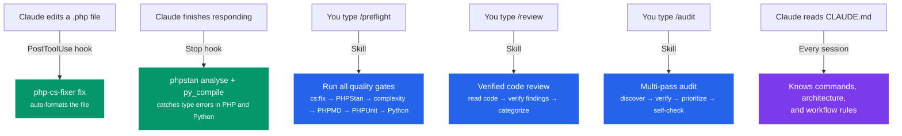

# Claude Code Workflow Configuration

This project includes a tuned [Claude Code](https://claude.ai/code) setup that catches mistakes early and enforces quality automatically across a full-stack PHP/Python codebase. This document explains what each piece does, why it exists, and how to adapt it for your own projects.

## File Layout

```
.claude/
├── settings.json                  # Hooks — run automatically on events
├── settings.local.json            # Local permissions (gitignored)
└── skills/
    ├── preflight/SKILL.md         # /preflight — run all quality gates
    ├── review/SKILL.md            # /review — deep code review
    └── audit/SKILL.md             # /audit — multi-pass codebase audit
CLAUDE.md                          # Project context + workflow rules
```

## How It All Fits Together



## CLAUDE.md — Project Context

Claude Code reads `CLAUDE.md` at the start of every session. It contains:

- **Commands** — build, test, lint, and analysis commands so Claude doesn't guess
- **Architecture** — data flow from Twig UI → PHP → Python agent → LLM provider
- **Code style** — PSR-12, PHPStan level 10, naming conventions
- **Workflow rules** — behavioral instructions (see below)

### Workflow Rules

These rules exist because of real problems observed during AI-assisted development. Each one addresses a specific failure mode.

#### Investigate before fixing

```markdown
When debugging issues, ALWAYS read the actual code and configuration files before
proposing a fix. Trace the real code path — do not guess based on class names, env
vars, or conventions.
```

**Why:** Without this, Claude tends to jump to fixes based on pattern-matching class names or env vars rather than reading what the code actually does. This leads to wrong diagnoses — e.g., misidentifying a CORS issue as a CSP issue because the symptoms look similar.

#### Check all layers

```markdown
After implementing any feature or fix, verify completeness across affected layers:
1. PHP service wiring (config/services.yaml, config/packages/strands.yaml)
2. Python agent endpoint contracts (Pydantic models in api/server.py)
3. Symfony route registration (controller attributes)
4. Twig template updates (templates/chatroom.html.twig)
5. Docker Compose environment variables if new config is needed
6. PHPUnit tests covering the new code path
7. PHPStan passes at Level 10
```

**Why:** This is a full-stack project with PHP, Python, Twig, Docker, and Mercure layers that are tightly coupled. A change to the Python agent's Pydantic request model breaks the PHP StrandsClient. A new Symfony config key needs a matching Docker Compose environment variable. Without an explicit checklist, features get shipped missing critical pieces.

#### Preflight before done

```markdown
Always run composer preflight BEFORE reporting that a task is complete.
```

**Why:** Without this, Claude declares "done" and the developer discovers failures manually. The preflight script takes seconds — faster to run automatically than to fix after the fact.

#### Deep investigation

```markdown
Do a DEEP first pass. Check for false positives before reporting.
```

**Why:** Surface-level findings are often wrong. Requiring verification by reading surrounding code filters out speculative issues and false positives. If told to "look deeper", treat it as a signal the first pass was insufficient.

#### Code review rigor

```markdown
When evaluating external review comments (Copilot, etc.), do NOT blindly apply
suggestions. Investigate each one against the actual codebase first.
```

**Why:** External tools (Copilot PR reviews, static analysis suggestions) sometimes produce false positives. Blindly applying them has caused breaking changes in real projects.

## Hooks — Automatic Quality Gates

Hooks are defined in `.claude/settings.json` and fire automatically on specific events.

### PostToolUse: Auto-format on every edit

```json
{
  "matcher": "Edit|Write",
  "command": "if echo \"$CLAUDE_FILE_PATH\" | grep -qE '\\.php$'; then vendor/bin/php-cs-fixer fix --quiet \"$CLAUDE_FILE_PATH\" 2>/dev/null; echo 'formatted'; fi"
}
```

**Event:** Fires after every `Edit` or `Write` tool call. If Claude edits 10 files in one turn, it fires 10 times.

**What it does:** Runs `php-cs-fixer fix` on the changed file. Only targets `.php` files — skips Python, Twig, YAML, etc.

**Why PostToolUse:** Formatting is sub-second and should happen on every file change. This prevents style drift from accumulating — every file is always clean.

**Adapting for other stacks:**
```json
// JavaScript/TypeScript
{ "matcher": "Edit|Write", "command": "npx prettier --write $CLAUDE_FILE_PATH 2>/dev/null" }

// Go
{ "matcher": "Edit|Write", "command": "gofmt -w $CLAUDE_FILE_PATH 2>/dev/null" }

// Python
{ "matcher": "Edit|Write", "command": "ruff format $CLAUDE_FILE_PATH 2>/dev/null" }
```

### Stop: Static analysis after every response

```json
{
  "command": "vendor/bin/phpstan analyse --no-progress --error-format=raw 2>&1 | head -10; python3 -m py_compile strands_agents/api/server.py 2>&1; python3 -m py_compile strands_agents/agents/__init__.py 2>&1"
}
```

**Event:** Fires once when Claude finishes a full response, regardless of how many tool calls were made.

**What it does:** Two checks in one pass:
1. **PHPStan** (level 10) — catches type errors, undefined methods, wrong argument types
2. **Python py_compile** — catches syntax errors in the agent files

Output is truncated to 10 lines to keep feedback concise.

**Why Stop (not PostToolUse):** Static analysis is slower (2-5 seconds) and needs to see the whole project, not individual files. Running it per-file would be noisy and slow. Running once at the end catches everything in one pass.

**Adapting for other stacks:**
```json
// TypeScript
{ "command": "npx tsc --noEmit 2>&1 | head -5" }

// Go
{ "command": "go vet ./... 2>&1 | head -5" }

// Python
{ "command": "mypy src/ 2>&1 | head -10" }
```

## Skills — Reusable Commands

Skills are markdown files in `.claude/skills/<name>/SKILL.md`. Invoke them by typing `/<name>` in Claude Code.

### /preflight

Runs all quality gates in sequence and fixes failures before declaring success.

```
1. composer cs:fix              — auto-fix code style
2. composer analyse             — PHPStan level 10
3. composer analyse:complexity  — cyclomatic complexity (max 20)
4. composer analyse:messdetector — PHPMD
5. composer test                — PHPUnit
6. Python syntax check          — all agent files
7. Fix and re-run on failure
8. Only report success when everything passes
```

**When to use:** Before committing, before declaring a task done, or whenever you want to validate the full project.

**Why a skill instead of just running the script?** The skill instructs Claude to **fix failures and retry**, not just report them. Running `composer preflight` manually would stop at the first failure. The skill creates a fix-and-verify loop.

### /review

Structured code review with mandatory verification of each finding.

```
1. Identify changed files (git diff)
2. Read every changed file thoroughly
3. For each finding: read 50+ lines of context, trace the code path, verify it's real
4. Categorize as critical or non-critical
5. Check cross-layer impact (PHP ↔ Python ↔ Docker)
6. Investigate external suggestions (Copilot) before applying
7. Run composer analyse and composer cs:check
```

**When to use:** Before submitting a PR, or when triaging external review comments.

**Why verification matters:** Without it, Claude reports surface-level findings that turn out to be false positives — wasting time on investigation and sometimes introducing bugs when "fixes" are applied to non-issues.

### /audit

Multi-pass codebase audit with self-verification.

```
/audit security
/audit performance
/audit bugs
/audit architecture
```

A structured 4-pass process:

| Pass | Purpose |
|------|---------|
| **Discovery** | Search all relevant files, log potential issues with file:line refs |
| **Verification** | Re-read context, trace code paths, confirm each issue is real |
| **Prioritization** | Rate by severity: Critical / High / Medium / Low |
| **Self-check** | Remove fabricated or unverified findings |

**When to use:** For thorough investigations. The multi-pass approach with mandatory verification prevents the common failure mode of reporting issues that don't actually exist in the code.

## Adapting This Setup for Your Project

### Minimum viable setup

For any project, start with:

1. **CLAUDE.md** with your build commands and architecture overview
2. **PostToolUse hook** for formatting
3. **Stop hook** for static analysis

```json
{
  "hooks": {
    "PostToolUse": [
      {
        "matcher": "Edit|Write",
        "command": "vendor/bin/php-cs-fixer fix --quiet \"$CLAUDE_FILE_PATH\" 2>/dev/null"
      }
    ],
    "Stop": [
      {
        "command": "vendor/bin/phpstan analyse --no-progress 2>&1 | head -10"
      }
    ]
  }
}
```

### For other languages

The pattern is the same — fast formatting on every edit, slower analysis once per response:

| Language | PostToolUse (per-file) | Stop (per-response) |
|----------|----------------------|---------------------|
| PHP | `php-cs-fixer fix` | `phpstan analyse` |
| TypeScript | `prettier --write` | `tsc --noEmit` |
| Go | `gofmt -w` | `go vet ./...` |
| Python | `ruff format` | `mypy src/` |
| Rust | `rustfmt` | `cargo check` |

### Adding workflow rules to CLAUDE.md

Start with these three — they address the most common failure modes:

1. **Investigate before fixing** — prevents wrong-root-cause debugging
2. **Check all layers** — prevents incomplete implementations
3. **Preflight before done** — prevents "works on my machine" surprises

Add project-specific rules as you discover failure patterns in your own sessions. The Claude Code `/insights` command can help identify recurring issues.

### Adding skills

Create a new directory under `.claude/skills/` with a `SKILL.md` file:

```bash
mkdir -p .claude/skills/my-skill
# Write the skill instructions in SKILL.md
```

The skill name matches the directory name. Invoke with `/my-skill`.

### Modifying hooks

Edit `.claude/settings.json`. The two hook types:

- **PostToolUse** — fires after each tool call. Use `matcher` to filter by tool name. Keep commands sub-second.
- **Stop** — fires once when Claude finishes responding. Good for analysis that needs the full picture.
