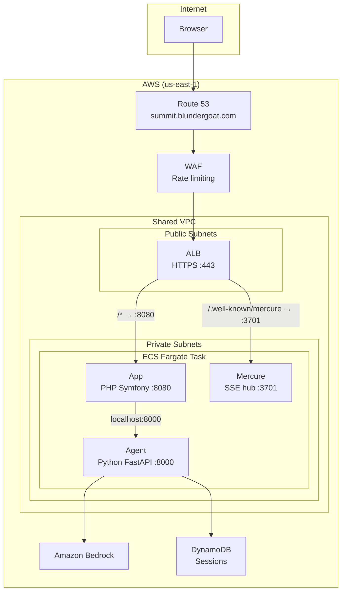
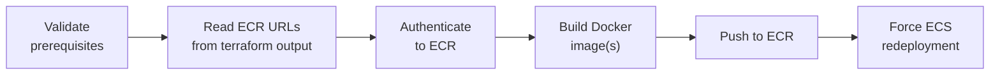

# Deployment Guide

This document covers the two deployment scripts used to provision and deploy The Summit to AWS.

## Prerequisites

- **AWS CLI** configured with the `aws_devgoat` SSO profile
- **Terraform** installed ([install guide](https://developer.hashicorp.com/terraform/tutorials/aws-get-started/install-cli))
- **Docker** running locally
- **strands-php-client** cloned as a sibling directory (`../strands-php-client`) — required for the app image build

If your AWS session has expired, re-authenticate first:

```bash
aws sso login --profile aws_devgoat
```

## Infrastructure Overview

The Terraform configuration lives under `infra/terraform/` with this layout:

```
infra/terraform/
  bootstrap/              # One-time setup: S3 state bucket + DynamoDB lock table
  environments/prod/      # Main infrastructure (all modules wired together)
  modules/
    alarms/               # CloudWatch alarms
    alb/                  # Application Load Balancer
    dns/                  # Route 53 + ACM certificate
    dynamodb/             # Session persistence table
    ecr/                  # Container registries (agent + app)
    ecs/                  # ECS cluster + task definition
    ecs-service/          # ECS Fargate service
    iam/                  # Task roles + GitHub OIDC
    observability/        # CloudWatch log groups
    secrets/              # Secrets Manager (API key)
    security/             # Security groups (ALB + ECS)
    waf/                  # WAF rate limiting
```

### Architecture



The app, agent, and Mercure run as sidecars in the same ECS task, communicating over `localhost`.

---

## scripts/terraform.sh

Wrapper around the `terraform` CLI that handles AWS profile setup, directory targeting, and auto-initialization.

### Usage

```bash
./scripts/terraform.sh <command> [options]
```

### Commands

| Command      | Description                                         |
| ------------ | --------------------------------------------------- |
| `init`       | Initialize Terraform (downloads providers, configures backend) |
| `plan`       | Preview changes without applying                    |
| `apply`      | Apply changes (supports `-y` for auto-approve)      |
| `destroy`    | Destroy all resources (requires confirmation)        |
| `output`     | Show Terraform outputs                              |
| `validate`   | Validate configuration files                        |
| `fmt`        | Format all `.tf` files recursively                  |
| `state`      | State management (list, show, mv, rm)               |
| `console`    | Interactive Terraform console                       |
| `refresh`    | Refresh state from AWS                              |
| `import`     | Import existing resources into state                |
| `unlock`     | Force-unlock state (requires lock ID)               |

### Options

| Flag            | Description                                  |
| --------------- | -------------------------------------------- |
| `-y`, `--yes`   | Auto-approve (skip confirmation prompts)     |
| `-h`, `--help`  | Show help                                    |
| `--bootstrap`   | Target the bootstrap module instead of prod  |

### First-Time Setup (Bootstrap)

The bootstrap module creates the S3 bucket and DynamoDB table that store Terraform's remote state. Run this once before provisioning any other infrastructure.

```bash
# 1. Provision state backend
./scripts/terraform.sh --bootstrap init
./scripts/terraform.sh --bootstrap apply

# 2. Configure the prod backend
cp infra/terraform/environments/prod/backend.hcl.example \
   infra/terraform/environments/prod/backend.hcl
# Edit backend.hcl with the values from bootstrap outputs

# 3. Initialize and apply prod
./scripts/terraform.sh init
./scripts/terraform.sh plan
./scripts/terraform.sh apply
```

### Day-to-Day Usage

```bash
# Preview what will change
./scripts/terraform.sh plan

# Apply changes with confirmation prompt
./scripts/terraform.sh apply

# Apply without confirmation
./scripts/terraform.sh apply -y

# Check current outputs (ECR URLs, cluster name, etc.)
./scripts/terraform.sh output

# Format all Terraform files
./scripts/terraform.sh fmt
```

### Environment

The script hardcodes these defaults (edit at the top of the file if needed):

| Variable           | Value          |
| ------------------ | -------------- |
| `AWS_PROFILE_NAME` | `aws_devgoat`  |
| `AWS_REGION`       | `us-east-1`    |

It also sources `.env` from the project root if present.

---

## scripts/deploy.sh

Builds Docker images for the agent and/or app containers, pushes them to ECR, and triggers an ECS service redeployment.

### Usage

```bash
./scripts/deploy.sh              # Build and deploy both images
./scripts/deploy.sh agent        # Build and deploy agent only
./scripts/deploy.sh app          # Build and deploy app only
```

### What It Does



1. **Validates prerequisites** — checks for Docker, AWS CLI, and active AWS credentials
2. **Reads ECR URLs from Terraform** — runs `terraform output` against the prod environment to get repository URLs and cluster name
3. **Authenticates to ECR** — runs `aws ecr get-login-password` and pipes it to `docker login`
4. **Builds Docker images**:
   - **Agent**: built from `strands_agents/Dockerfile` with context `strands_agents/`
   - **App**: built from the project root `Dockerfile`, with `--build-context strands-php-client=../strands-php-client` to include the local path dependency
5. **Pushes images to ECR** with the configured tag
6. **Forces ECS redeployment** — calls `aws ecs update-service --force-new-deployment` on the `the-summit-app` service to roll out the new images

### Image Tag

The default tag is `latest`. Override it with the `IMAGE_TAG` environment variable:

```bash
IMAGE_TAG=v1.2.3 ./scripts/deploy.sh
```

### Typical Deployment Flow

```bash
# 1. Make sure infrastructure is up to date
./scripts/terraform.sh plan
./scripts/terraform.sh apply

# 2. Deploy new code
./scripts/deploy.sh

# 3. Monitor the rollout
aws ecs describe-services \
  --cluster the-summit-cluster \
  --services the-summit-app \
  --query 'services[0].deployments' \
  --no-cli-pager
```

### Deploying a Single Service

If you only changed the Python agent code:

```bash
./scripts/deploy.sh agent
```

If you only changed the PHP app code:

```bash
./scripts/deploy.sh app
```

Both still trigger an ECS redeployment since the agent and app share a single task definition.
